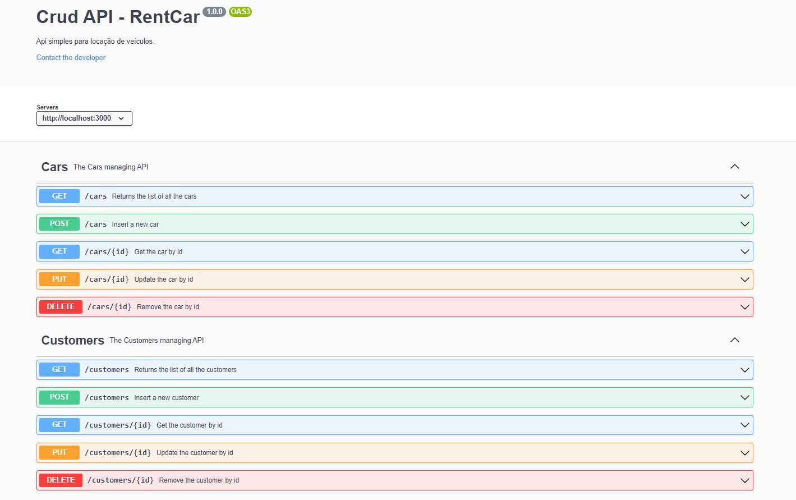
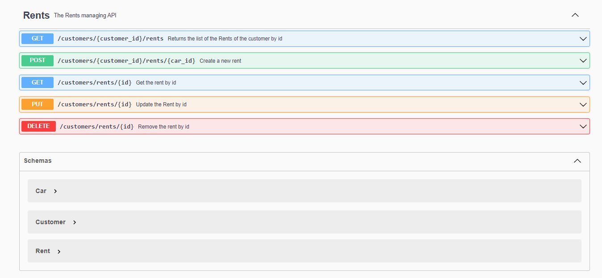
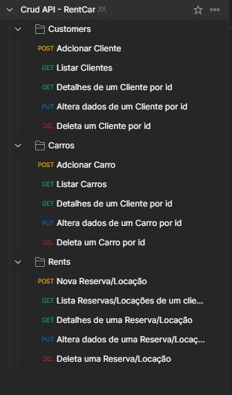

<<<<<<< HEAD
# Teste para candidatos à vaga de desenvolvedor Back-end NodeJS

> Todos os interessados que fizerem pull request e enviarem o curriculo para **felipe.alves@fbmobile.com.br** com assunto **NOME DA VAGA + NOME DA EMPRESA** receberão um feedback.

## CRIAR UM CRUD
CRUD significa Criar, Ler, Atualizar e Excluir . Quais são as operações básicas que um aplicativo da web simples deve realizar.

 ## Iniciando Teste

Para iniciar o teste, faça um fork deste repositório.

1. Baixe o fork em sua maquina;
2. Crie seu CRUD, necessário conter 10 campos.
3. Utilizar plugin de sua escolha parar gerar a documentação da API, e informar no readme.md como gerar ela.
4. Adicionar no seu readme.md o link da colletciton no postman

## BANCO DE DADOS 
Utilizar um banco de dados Cloud para facilitar nossos teste.
Caso não conheça nenhum segue uma indicação https://mlab.com/

* **Importante:** Usamos o mesmo teste para todos os níveis de front: **júnior**, **pleno** ou **sênior**, mas procuramos adequar nossa exigência na avaliação com cada um desses níveis sem, por exemplo, exigir excelência de quem está começando :-)


**Boa sorte!**
=======

#Crud API - RentCar
Api simples para locação de veículos, densevolvida para o teste de candidatos à vaga de desenvolvedor Back-end NodeJS.

**Collection**: <a href="https://www.getpostman.com/collections/2dd5689c1bdc77d91c4a" target="_blank">https://www.getpostman.com/collections/2dd5689c1bdc77d91c4a</a>

**Documentação**: http://localhost:3000/api-docs/

### dependencias:
- express
- pg and pg-hstore
- sequelize
- swagger-jsdoc e swagger-ui-express (documentação)
- ElephantSQL (cloud para teste rapido)

## Installation
```
npm install
or
yarn install
```

## Teste Rapido
Para facilitar o teste, as configurações de banco de dados já estão preenchidas com um servidor para testes hospedado na elephantsql.

```
npm start
```
servidor rodando na url: http://localhost:3000

## Teste Avançado
após instalar as dependencias,
- setar as configurações do banco de dados em
src -> config -> database.js
- rodar as migrations
```
npx sequelize db:migrate
```
- start no servidor
 ```
 npm start
```

### documentação:
```
com o servidor online:
http://localhost:3000/api-docs/
```


## Crud API - RentCar

**Documentação com swagger 01:



**Documentação com swagger 02:



**Collection postman:


>>>>>>> 3ee0507499fa803728664badd9a64bf0fd01fbe4
